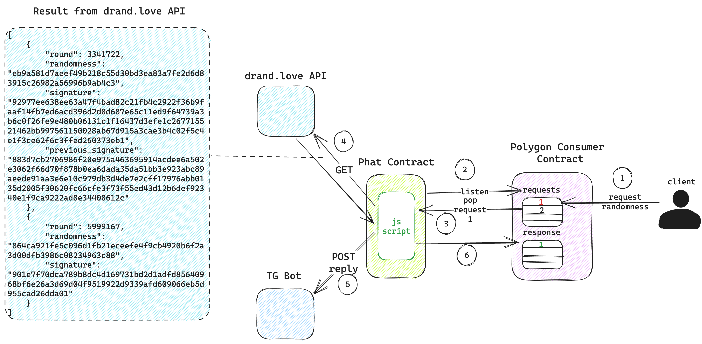

# Phat Randomness from Drand.love

This is an example of building a Phat Contract to retrieve randomness from drand.love API then post results to a Telegram group and report the randomness of the first value to the on-chain Polygon smart contract.

## High Level Design
Here you can see the design is quite simple. 
- Client requests for randomness on the Polygon consumer smart contract. 
- The Phat Contract 2.0 deployed on Phala Network will listen for new requests. 
- When a request is added to the queue, the Phat Contract pops the action request off the queue. 
- Next, the Phat Contract will query the drand.love HTTP endpoint and get the latest randomness of the 4 chains. 
- This result is pushed to a Telegram group. 
- Then the Phat Contract pushes the action reply to the Polygon on-chain smart contract.

